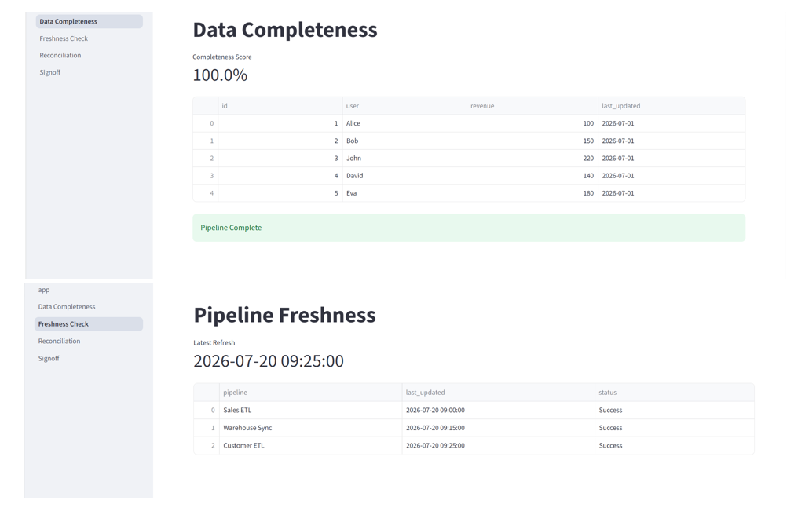
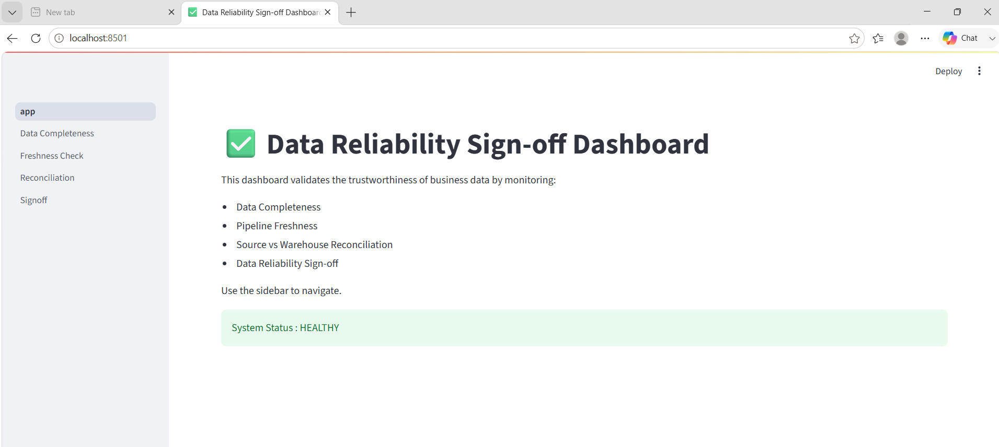
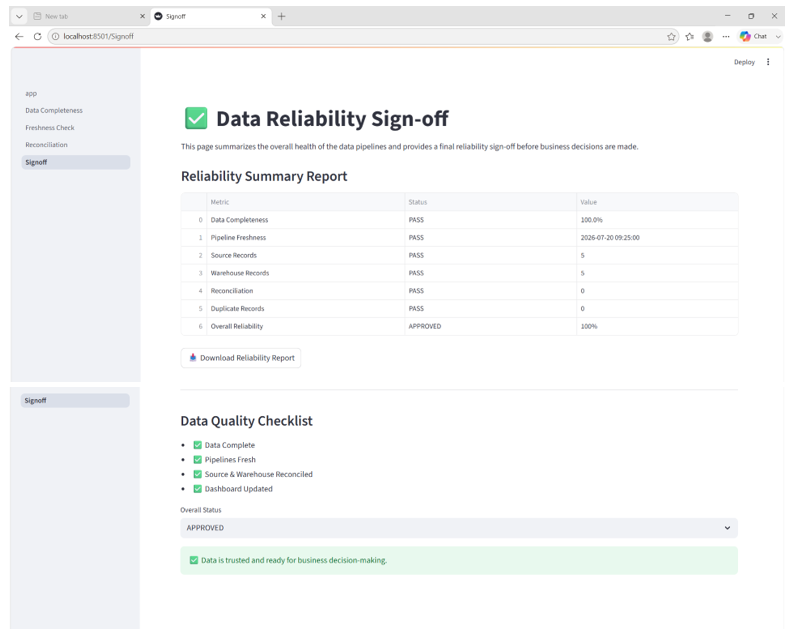

# ✅ Data Reliability Sign-off Dashboard

An interactive **Streamlit dashboard** that validates the reliability of analytics data before it is used for business decision-making. The application monitors **data completeness**, **pipeline freshness**, **source-to-warehouse reconciliation**, and provides a final **data reliability sign-off** to ensure trusted reporting.

---

## 🚀 Features

- ✅ Data Completeness Monitoring
- ⏱️ Pipeline Freshness Validation
- 🔄 Source vs Warehouse Reconciliation
- 📋 Data Reliability Sign-off
- 📊 Interactive KPI Dashboard
- 📥 Downloadable Reliability Summary Report
- 📈 Real-time Data Quality Metrics

---

## 🛠️ Tech Stack

- Python
- Streamlit
- Pandas
- NumPy
- Plotly

---

## 📂 Project Structure

```text
data_reliability_signoff_dashboard/
│
├── app.py
├── Procfile
├── requirements.txt
├── README.md
│
├── data/
├── pages/
├── utils/
├── reports/
├── assets/
│   └── reliability_architecture.png
│
└── screenshots/
    ├── dashboard.png
    └── reliability_report.png
```

---

## 🏗️ System Architecture

The following diagram illustrates the end-to-end data reliability validation workflow.



---

## 📸 Dashboard Preview

### Main Dashboard



### Reliability Summary Report



---

## 📊 Dashboard Modules

### 1. Data Completeness
- Measures missing values across datasets
- Calculates completeness percentage
- Flags incomplete records

### 2. Pipeline Freshness
- Tracks latest ETL execution timestamps
- Monitors data freshness
- Detects stale pipelines

### 3. Source vs Warehouse Reconciliation
- Compares source and warehouse record counts
- Identifies synchronization issues
- Highlights reconciliation differences

### 4. Data Reliability Sign-off
- Generates an overall reliability assessment
- Provides downloadable CSV reports
- Supports business decision readiness

---

## 📁 Sample Dataset

The project includes sample datasets for demonstration:

- `source_system.csv`
- `warehouse.csv`
- `pipeline_log.csv`

These datasets simulate production data for validating data quality and reliability.

---

## ▶️ Installation

Clone the repository:

```bash
git clone https://github.com/yourusername/data_reliability_signoff_dashboard.git
```

Navigate to the project folder:

```bash
cd data_reliability_signoff_dashboard
```

Install dependencies:

```bash
pip install -r requirements.txt
```

Run the application:

```bash
streamlit run app.py
```

---

## 🌐 Deployment

The application is configured for deployment on **Render**.

**Build Command**

```bash
pip install -r requirements.txt
```

**Start Command**

```bash
streamlit run app.py --server.port=$PORT --server.address=0.0.0.0
```

---

## 📈 Future Enhancements

- Database integration (PostgreSQL/MySQL)
- Automated ETL monitoring
- Historical data quality trends
- Email and Slack alerting
- Great Expectations integration
- Airflow pipeline monitoring
- Scheduled reliability reports

---


